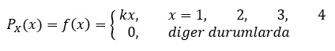

# Probability Mass Function (PMF)

* @file     : Probability_Mass_Function.ipynb
* @author   : Sinan KAMILCELEBI
* @version  : V1.0.0
* @date     : 03-May-2019
* @brief    : Random Variables and Expectations Example.

## Örnek Soru:
Aşağıda X kesikli rastlantı değişkenine (rastgele değişken) ait olasılık fonksiyonu (PMF) verilmiştir.

Verilen bu olasılık fonksiyonuna göre:

<b>A)</b> k kaçtır?   

<b>B)</b> PMF'yi tablo şeklinde gösteriniz ve ayrık grafiğini çizdiriniz?

<b>C)</b> P(x = 2) kaçtır?

<b>D)</b> P(2 < x) kaçtır?

<b>E)</b> Beklenen değer kaçtır?

<b>F)</b> Var(x) kaçtır?

<b>G)</b> Standart sapma kaçtır?

<b>H)</b> Dağılım fonksiyonunu bulunuz? (Kümülatif (birikimli) olasılık dağılımını)

## Açıklamalar: 
<b>A - B)</b> ΣP(X = x) = 1 ve P(X = x) >= 0 olmalıdır.  

<b>D)</b> P(2 < x) = P(x = 3) + P(x = 4)   

<b>E)</b> E[X] = Σx * P(X = x) 

<b>F)</b> Var[X] = E[X ^ 2] - (E[X]) ^ 2)    
E[X ^ 2] = Σx ^ 2 * P(X = x)

<b>G)</b> Standart sapma = Karekök(Var(x))   

<b>H)</b> Dağılım fonksiyonu (Kümülatif Olasılık Dağılımı) oluşturulan PMF tablosuna veya ayrık grafiğinine göre olasılık değerlerinin toplanmasıyla elde edilir.
