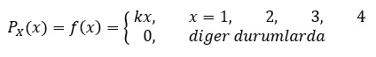

# Probability Mass Function (PMF)

* @file     : Probability_Mass_Function.ipynb
* @author   : Sinan KAMILCELEBI
* @version  : V1.0.0
* @date     : 03-May-2019
* @brief    : Random Variables and Expectations Example.

## __Örnek Soru:__ 

Aşağıda X kesikli rastlantı değişkenine (rastgele değişken) ait olasılık fonksiyonu (PMF) verilmiştir.

<b>A)</b> k kaçtır?   

<b>B)</b> PMF'yi tablo şeklinde gösteriniz ve ayrık grafiğini çizdiriniz?

<b>C)</b> P(x = 2) kaçtır?

<b>D)</b> P(2 < x) kaçtır?

<b>E)</b> Beklenen değer kaçtır?

<b>F)</b> Var(x) kaçtır?

<b>G)</b> Standart sapma kaçtır?

<b>H)</b> Dağılım fonksiyonunu bulunuz? (Kümülatif (birikimli) olasılık dağılımını)

## __Açıklamalar:__ 
